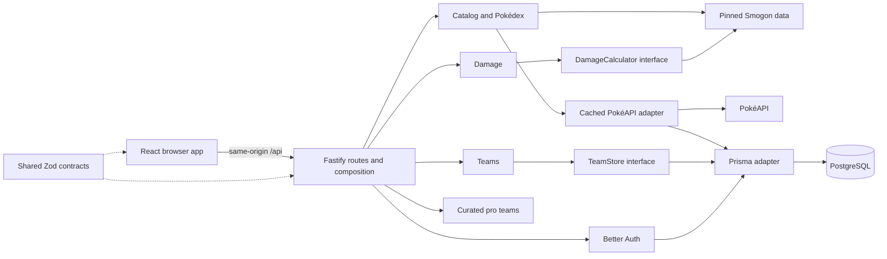

# System architecture

**Scope:** the approved English-first Generation 9 Scarlet/Violet release. **Status:** this is a living map of the local implementation and approved deployment design. The application builds and its local API/UI have been exercised. On the mini PC, Caddy and both databases are running; public HTTPS and private staging Serve reach Caddy, but the app containers are not deployed. The encrypted USB repository passes `restic check`; a restore drill and full ingress security checks remain. The [requirements](../requirements/requirements.md) distinguish accepted scope from implementation and verification progress.

This document describes responsibilities and interactions. The accepted decisions and their trade-offs are recorded in the ADRs listed below.

## Workspace and runtime

| Location | Responsibility |
| --- | --- |
| [`apps/web`](../../apps/web/) | React/Vite frontend, feature views, guest drafts, and same-origin API calls. |
| [`apps/api`](../../apps/api/) | One Fastify process with HTTP routes and the `catalog`, `damage`, `teams`, `pro-teams`, and `auth` modules. |
| [`packages/contracts`](../../packages/contracts/) | Browser-safe Zod request and data schemas shared by the frontend and API. |
| [`infra`](../../infra/) | Separate Compose projects, shared Caddy configuration, deployment, backup, and restore scripts. |
| [`docs`](../) | Requirements, system map, decision history, and operating guidance. |

Local development uses Vite at `127.0.0.1:5173` and its `/api` proxy to a Fastify process at `127.0.0.1:4000`. The deployment image contains the built frontend and API; Fastify serves the static frontend and `/api` on its internal port. The browser therefore calls `/api` on its own origin. Staging and production use the same image digest with separate runtime configuration and PostgreSQL databases; no database or auth secret is bundled into the image.

## Application interactions

The diagram shows application dependencies, not separate deployable services. [`app.ts`](../../apps/api/src/app.ts) currently registers routes, cross-cutting Fastify plugins, and concrete modules in one place. It is the composition point as well as the HTTP route file. The API's `NODE_ENV`, deployment environment, base URL, trusted origins, database URL, and edge CIDR are read from runtime configuration.

| Module | Current responsibility and boundary |
| --- | --- |
| `catalog` | Supplies Generation 9 species, moves, abilities, items, natures, and type effectiveness from pinned `@smogon/calc` data. Its [PokéAPI adapter](../../apps/api/src/modules/catalog/pokeapi-adapter.ts) requests descriptive Pokémon details, caches them in PostgreSQL, and reports unavailable details when needed. Battle facts remain independent of that request. |
| `damage` | Validates known catalog names and passes a selected set, move, and field to the [Smogon adapter](../../apps/api/src/modules/damage/smogon-adapter.ts). Its `DamageCalculator` interface allows application-level substitution in tests. The response includes damage ranges and a one-hit KO chance conditional on a hit. |
| `teams` | Exposes save, list, and delete operations for the authenticated owner. The [TeamStore interface](../../apps/api/src/modules/teams/teams.ts) is implemented by a [Prisma adapter](../../apps/api/src/modules/teams/prisma-adapter.ts); owner filtering is applied in persistence operations. |
| `pro-teams` | Serves a small manually curated collection with publication, event, player, and spread provenance. Unlisted IVs are represented as unknown rather than inferred. |
| `auth` | Uses Better Auth with Prisma-backed users, sessions, accounts, and verification records. The API checks the session before private team operations. |

The boundaries are pragmatic rather than a full Clean Architecture directory layout. In particular, team validation calls `damage.validateSet`, whose default implementation wires the Smogon adapter. Simple catalog reads also use `@smogon/calc` directly. These observed dependencies should not be described as a strict dependency inversion boundary. They are candidates for refactoring if they impede tests or feature changes; no refactor is implied by this document alone.

## Data and ownership

Guest team and comparison drafts are kept in browser `localStorage` and can contain up to six sets each. Saved teams are private database records tied to an authenticated user. The [Prisma schema](../../apps/api/prisma/schema.prisma) has `User`, `Session`, `Account`, and `Verification` records for auth, `Team` for saved sets, and `PokedexCache` for descriptive metadata. All tables are currently in one database per environment; module ownership is a code-level convention, not separate database schemas.

Battle facts and damage mechanics come from pinned `@smogon/calc`. PokéAPI contributes sprites and other descriptive fields only, using explicit form mappings where supported. A PokéAPI outage can leave those fields unavailable or stale without replacing battle values. Pro teams come from manually credited publications and linked team pastes. The [data sources and publication policy](../data-sources.md) records the source rules, current coverage limits, and audit findings. These flows support [REQ-003](../requirements/requirements.md#req-003), [REQ-004](../requirements/requirements.md#req-004), [REQ-006](../requirements/requirements.md#req-006), [REQ-008](../requirements/requirements.md#req-008), and [REQ-009](../requirements/requirements.md#req-009).

## Environment topology

Three Compose projects are defined: shared Caddy, staging app/database, and production app/database. Caddy joins one dedicated edge network for each app and has its own ingress network. Each app also joins only its own internal database network. The database services are absent from edge networks, and Fastify publishes no host port. This topology is configuration in the repository; its behavior must be checked on the mini PC.

| Browser path | Intended route to the application |
| --- | --- |
| Public production, preferred | Browser → repaired DuckDNS record and HTTPS → Caddy public listener → production Fastify. |
| Private staging | Authorized tailnet browser → Tailscale Service with Serve HTTPS → host-loopback Caddy staging listener → staging Fastify. |
| Public production fallback | Browser → Tailscale Funnel HTTPS → a different host-loopback Caddy production listener → production Fastify. |

Staging uses a hostname distinct from production, including the Funnel fallback, so their host-scoped cookies are separated. Caddy is the application-facing reverse proxy on all three paths. Its configuration overwrites browser-supplied forwarding headers on the public listener. The Tailscale-facing listeners are configured to accept forwarded client-address information only from their configured immediate proxy peer and to overwrite the headers passed to Fastify. Fastify's ingress guard checks the raw socket peer against its environment's edge CIDR before auth, and its proxy trust is limited to that CIDR. Better Auth uses Caddy's sanitized client-IP header and explicit base URLs and trusted origins. The boundary depends on controlled network membership and CIDRs, not a stable Caddy container IP. These are implemented controls whose deployment behavior remains to be verified on the mini PC. See [REQ-011](../requirements/requirements.md#req-011) and [REQ-012](../requirements/requirements.md#req-012).

## Delivery and recovery interfaces

GitHub checks precede a staging build. A successful staging workflow publishes one image to GHCR, deploys its immutable digest, smoke-tests it through the private staging path, and records the commit, Git tree, and digest. A protected production promotion compares the main Git tree with that tested tree and deploys the same digest after approval. Deployment and rollback recreate only the app service; migrations must remain compatible with the preceding image. PostgreSQL backup and restore scripts target an encrypted repository on the mini PC's USB drive. The production script requires public ingress and USB restore gate markers. The [operations guide](../operations.md) contains the host procedure and remaining gates; [REQ-014](../requirements/requirements.md#req-014), [REQ-015](../requirements/requirements.md#req-015), and [REQ-016](../requirements/requirements.md#req-016) track their progress.

## Verification status and known gaps

- Local build, type, lint, unit/API composition, Prisma schema, and static YAML checks have passed. The type chart and default damage calculation have also been inspected in the local browser preview.
- Database-backed account journeys, adapter integration tests, CI Playwright runs, and the full OpenAPI response-schema audit are pending. The generated API description exists, but route response coverage is incomplete; see [REQ-010](../requirements/requirements.md#req-010) and [REQ-017](../requirements/requirements.md#req-017).
- The application image has not been started through Compose on the mini PC. Caddy parsed and started; DuckDNS HTTPS and the private staging Tailscale Service both reached Caddy, where they returned 502 because the matching API containers are absent. Tailscale Funnel, proxy-header behavior, email delivery, a disposable USB restore drill, and application behavior on the host remain unverified. No application environment is described as live production.

## Decision records

| Record | Decision |
| --- | --- |
| [ADR-001](../adr/ADR-001-modular-monolith.md) | Modular monolith and pragmatic Clean boundaries. |
| [ADR-002](../adr/ADR-002-data-authority-and-provenance.md) | Battle, descriptive, and published data authority. |
| [ADR-003](../adr/ADR-003-private-teams-and-identity.md) | Private team storage and identity. |
| [ADR-004](../adr/ADR-004-compose-and-shared-caddy.md) | Compose topology and shared Caddy. |
| [ADR-005](../adr/ADR-005-caddy-proxy-trust.md) | Controlled proxy trust path. |
| [ADR-006](../adr/ADR-006-immutable-release-and-recovery.md) | Digest promotion and recovery gates. |

## Course influence and project ownership

The validated course documents **Arquitectura del software → Introducción a la arquitectura de software → Monolito modular** and **Aplicando Clean Architecture con TypeScript → Estructura de carpetas de un proyecto Clean** and **Puertos y adaptadores** explain modular boundaries and dependency choices. They inform the description here; they do not select this project's technology stack, module names, or deployment topology. Those are owner-approved Pokémon Tools decisions. The course material stays in the private knowledge base and is not copied into this public repository.
